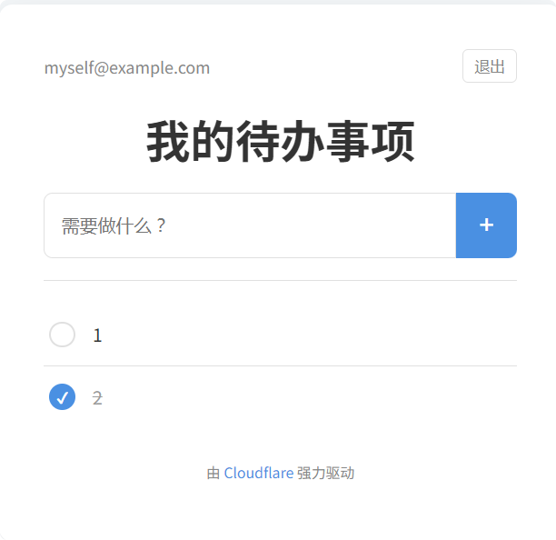

# Cloudflare 全栈 Todo List

一个基于 Cloudflare Pages, Functions, D1 数据库和 KV 存储构建的美观、简约的待办事项（Todo List）应用。



## ✨ 功能特性

- **美观简约的界面**：采用现代、干净的 UI 设计，专注于核心的待办事项管理功能。
- **无密码登录**：通过简单的邮箱地址进行“登录”，无需管理复杂的密码，会话信息安全地存储在 Cloudflare KV 中。
- **云端同步**：所有待办事项数据持久化存储在 Cloudflare D1 数据库中，确保数据安全并在不同设备间同步。
- **全栈 Serverless**：前端静态页面和后端 API 函数无缝集成，全部托管在 Cloudflare 的全球边缘网络上，性能卓越。
- **原生集成**：100% 利用 Cloudflare Pages, Functions, D1 和 KV，无需任何外部服务或复杂的配置。
- **易于部署**：只需一个 Cloudflare 账户和一个 GitHub 仓库，几分钟内即可完成部署。

## 🛠️ 技术栈

- **前端**: HTML5, CSS3, Vanilla JavaScript (无框架依赖)
- **后端**: Cloudflare Pages Functions
- **数据库**: Cloudflare D1 (基于 SQLite)
- **会话存储**: Cloudflare KV
- **部署与托管**: Cloudflare Pages

## 🚀 部署指南

按照以下步骤，您可以轻松部署属于您自己的 Todo List 应用。

### 前提条件

- 一个 [Cloudflare](https://www.cloudflare.com/) 账户。
- 一个 [GitHub](https://github.com/) 账户。
- Git 已在您的本地计算机上安装。

### 第一步：Fork 或克隆此仓库

首先，将此仓库 Fork 到您自己的 GitHub 账户中，然后将其克隆到本地：

```bash
git clone https://github.com/Xiefengshang/cf_todo_list.git
cd your-repo-name
```

### 第二步：创建 Cloudflare D1 数据库和 KV 命名空间

1.  **创建 D1 数据库**:
    - 登录 Cloudflare 控制台，转到 **Workers & Pages** -> **D1**。
    - 点击 **Create database**，给数据库命名（例如 `todo-db`）。
    - 创建后，进入数据库的 **Console** 标签页，执行以下 SQL 命令来创建 `todos` 表：

      ```sql
      CREATE TABLE todos (
          id TEXT PRIMARY KEY,
          user_email TEXT NOT NULL,
          content TEXT NOT NULL,
          completed INTEGER DEFAULT 0,
          created_at TIMESTAMP DEFAULT CURRENT_TIMESTAMP
      );
      ```

2.  **创建 KV 命名空间**:
    - 转到 **Workers & Pages** -> **KV**。
    - 点击 **Create a namespace**，给命名空间命名（例如 `TODO_SESSIONS`）。

### 第三步：连接到 Cloudflare Pages

1. 在 Cloudflare 控制台，转到 **Workers & Pages** -> **Create application** -> **Pages** -> **Connect to Git**。
2. 选择您 Fork 的 GitHub 仓库并开始设置。

### 第四步：配置构建与部署

在构建设置页面，填入以下信息：

| 设置项             | 值        | 说明                                               |
| ------------------ | ---------- | -------------------------------------------------- |
| **框架预设** | `None`     | 我们没有使用特定框架，无需预设。                   |
| **构建命令** | (留空)     | 无需编译步骤。                                     |
| **构建输出目录** | `/public`  | 我们的静态文件 (`index.html` 等) 在 `public` 目录下。 |
| **根目录** | (留空)     | 默认为仓库根目录。                                 |

点击 **Save and Deploy** 进行首次部署。这次部署后应用还无法正常工作，因为还未连接数据库。

### 第五步：配置函数绑定

1. 进入刚刚创建的 Pages 项目，点击 **Settings** -> **Functions** -> **Functions integrations**。
2. **绑定 KV Namespace**:
   - 点击 **Add binding**。
   - **变量名称**: `TODO_SESSIONS`
   - **KV 命名空间**: 选择您在第二步创建的 `TODO_SESSIONS`。
3. **绑定 D1 Database**:
   - 点击 **Add binding**。
   - **变量名称**: `DB`
   - **D1 数据库**: 选择您在第二步创建的 `todo-db`。

   > **注意**: 这里的变量名称必须与 `functions/api/[[proxy]].js` 代码中使用的 `env.DB` 和 `env.TODO_SESSIONS` 完全匹配。

### 第六步：重新部署

回到项目的 **Deployments** 选项卡，点击 **Retry deployment** 以应用新的绑定。部署成功后，您的应用就可以在线访问了！

## 📂 项目结构

```
/
├── public/           # 存放所有前端静态文件
│   ├── index.html    # 应用主页面
│   ├── style.css     # 样式表
│   └── script.js     # 前端逻辑
└── functions/        # 存放所有后端 API (Cloudflare Functions)
    └── api/
        └── [[proxy]].js  # 捕获所有 /api/* 的请求，处理所有后端逻辑
```

## 📄 许可证

本项目采用 [MIT License](LICENSE)。
